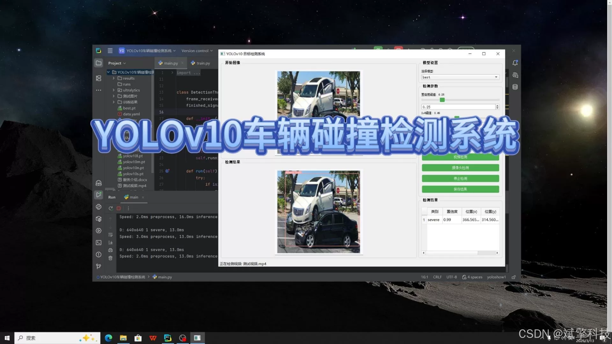
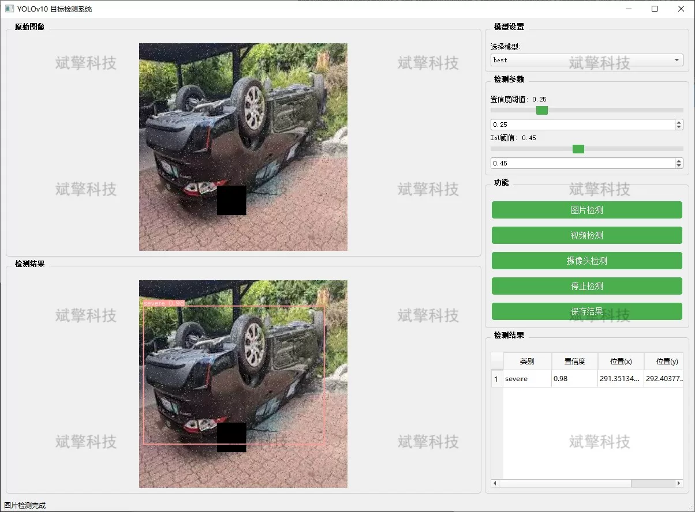
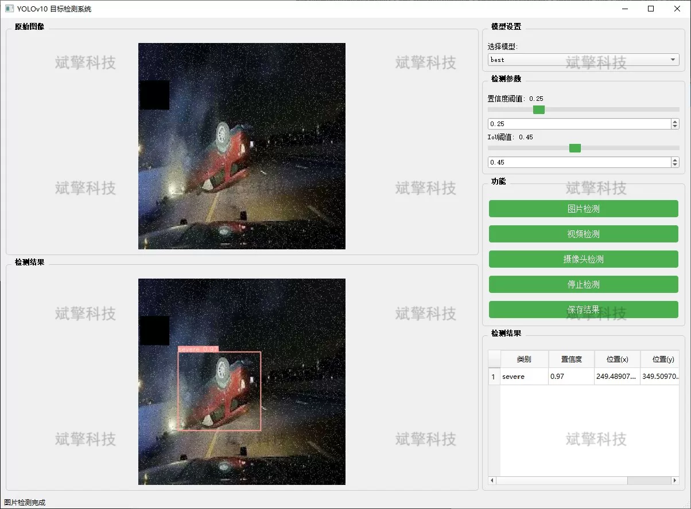
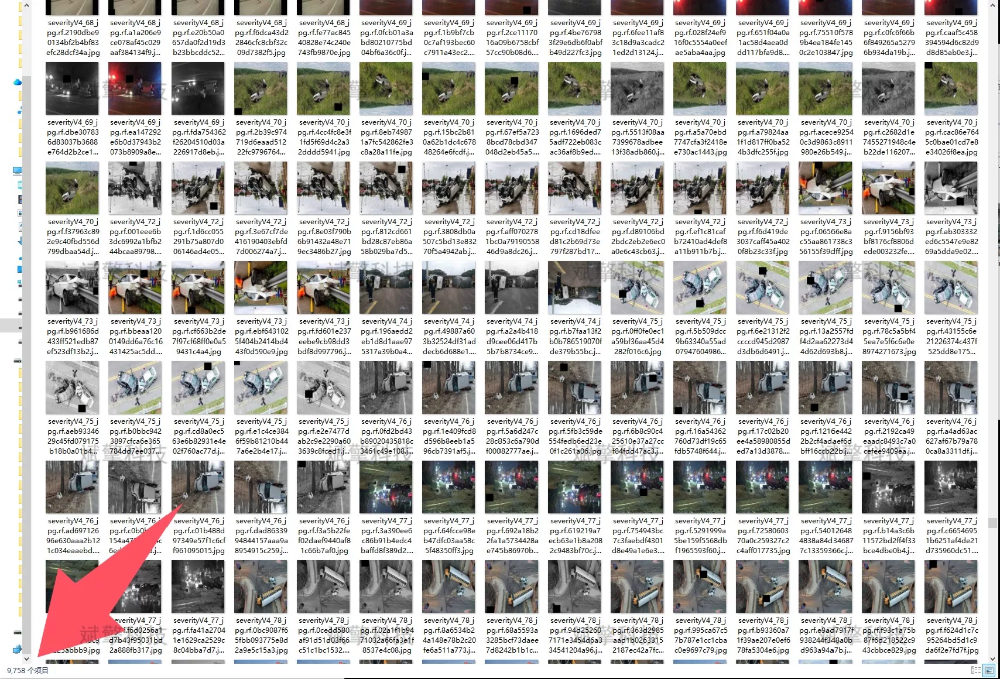
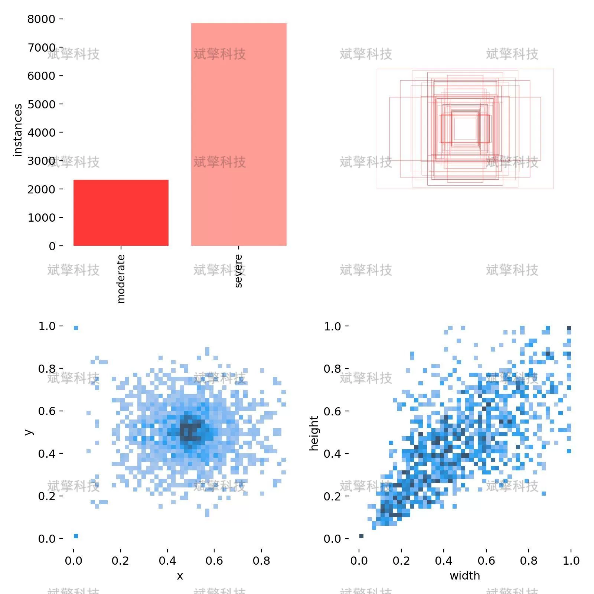
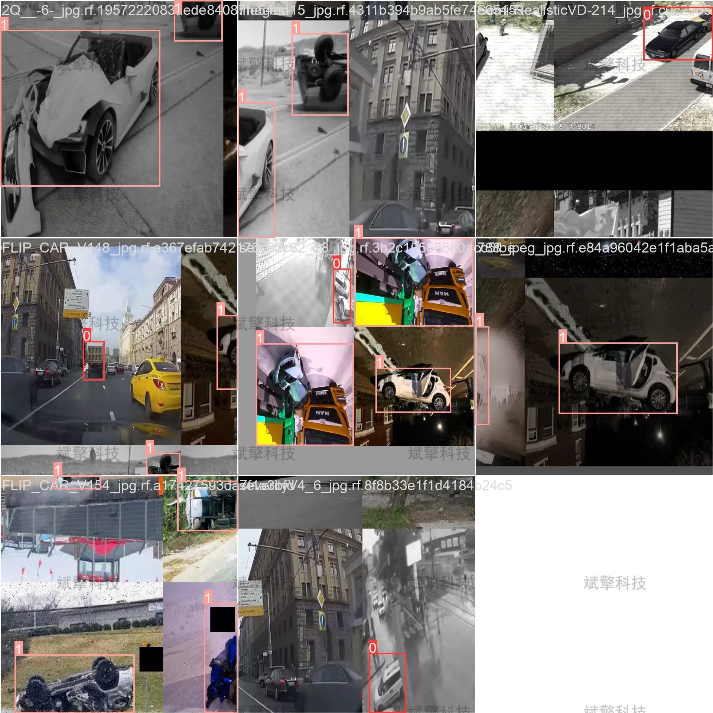
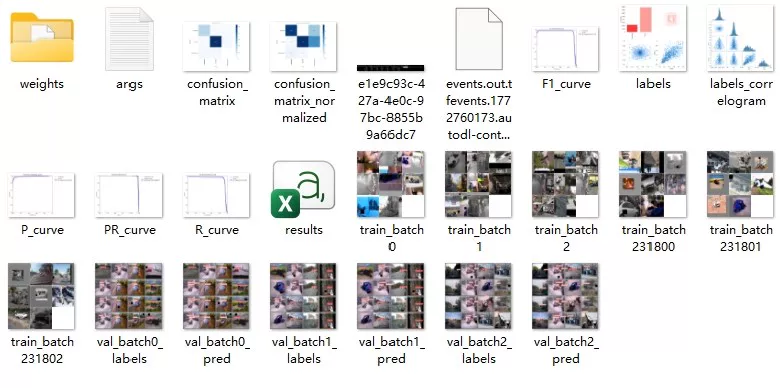
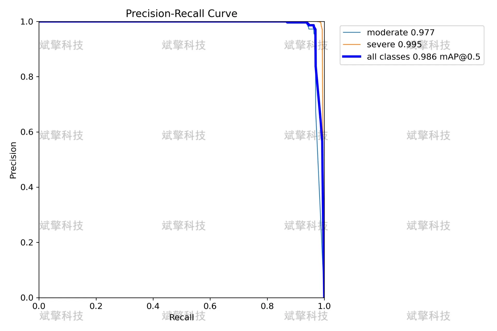
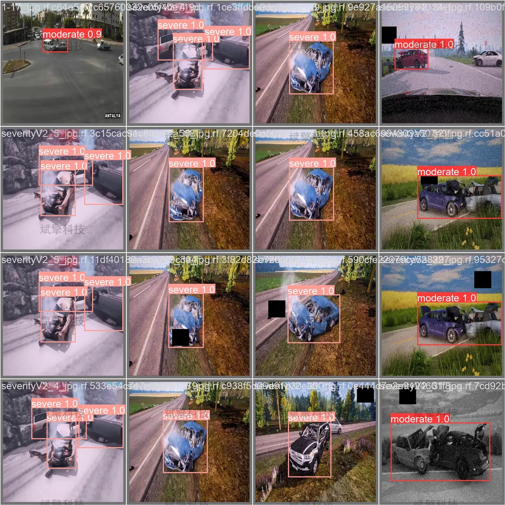

# YOLOv10 vehicle collision detection system

## Body

YOLOv10 Vehicle Collision Detection System, a vehicle collision detection system based on the cutting-edge YOLOv10 deep learning target detection algorithm, has been designed and implemented. This system eliminates complex preprocessing processes and can directly perform high-precision analysis on images, video streams, and real-time camera footage.

The project innovatively categorizes the level of collision into "moderate" and "severe," aiming to provide precise data support for intelligent traffic monitoring, autonomous driving assistance, and accident quick accountability. Experimental results show that the model performs exceptionally well on its own high-quality dataset, demonstrating good robustness and real-time capabilities, meeting the deployment needs in practical application scenarios.

System Features
✅ Image Detection: Can detect images and return detection boxes and category information.
✅ Video Detection: Supports video file input, detecting the situation in each frame of the video.
✅ Real-Time Camera Detection: Connects USB cameras to achieve real-time monitoring.
✅ Parameter Real-Time Adjustment (Confidence and IoU Threshold)
Dataset Introduction
Training set (Train): A total of 9,758 images.
Validation set (Val): A total of 1,347 images.
Test set (Test): A total of 675 images.

## Images

## Payment

Here is a pay link on Stripe ( https://buy.stripe.com/3cs8yP7sY87d0vu9AB ). Please contact me lonlonago@foxmail.com after funding $89, and I will send you a complete data files , thank you!

